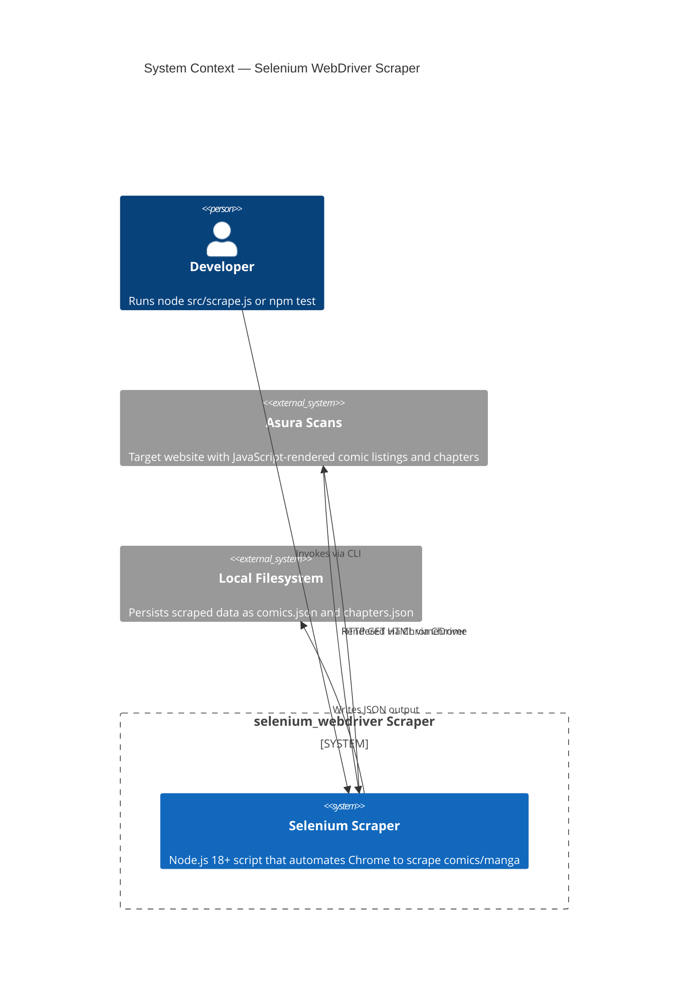
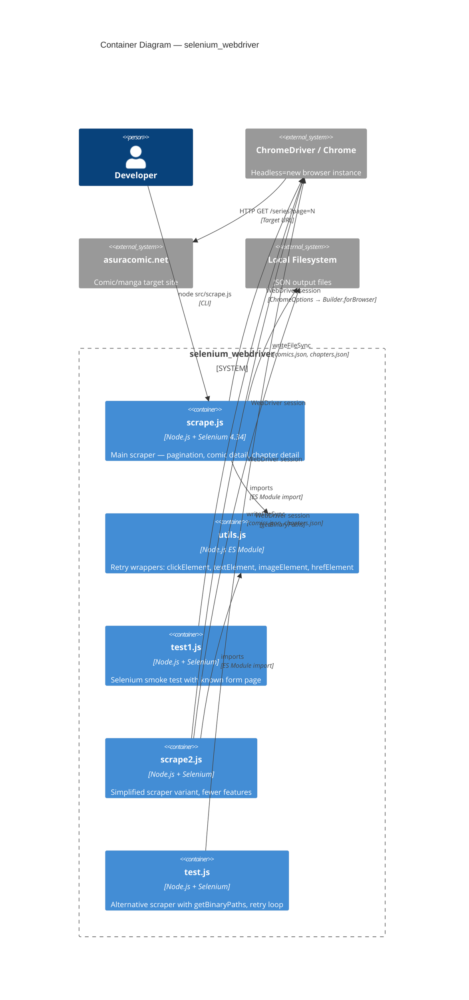
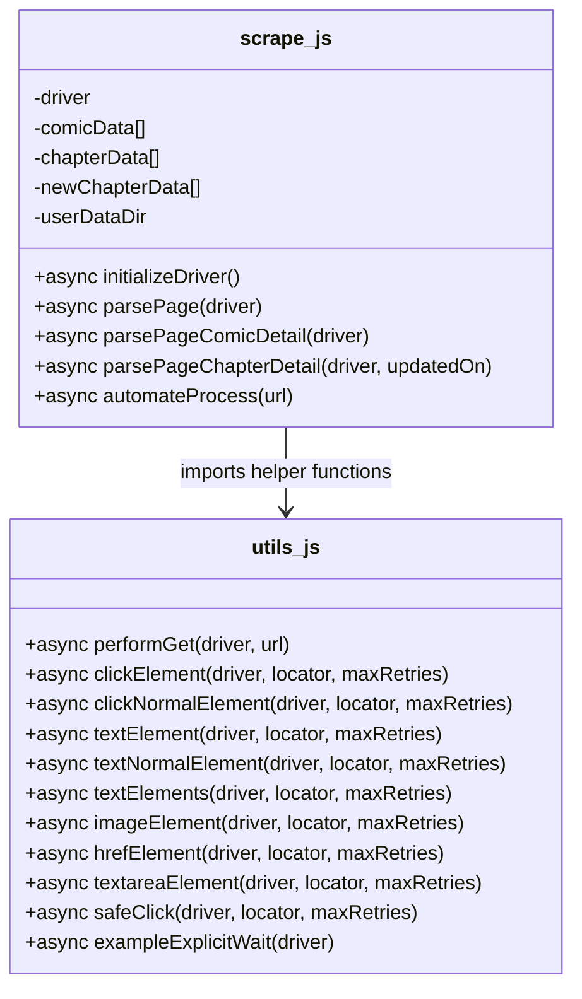
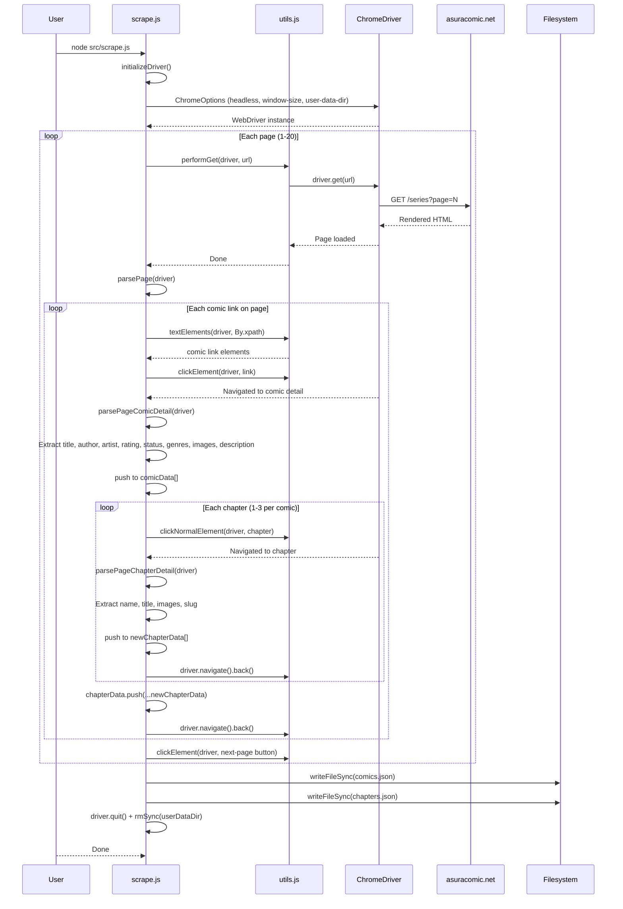
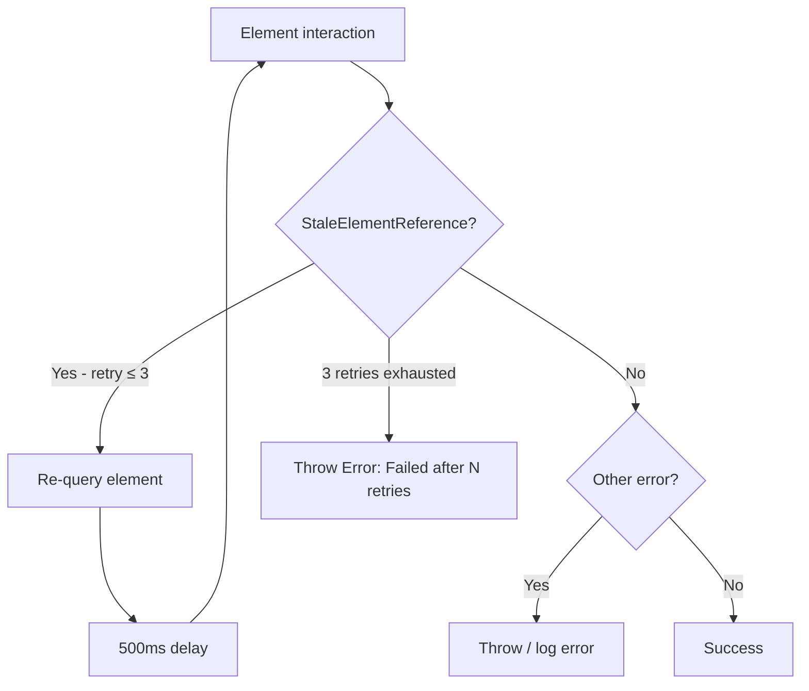
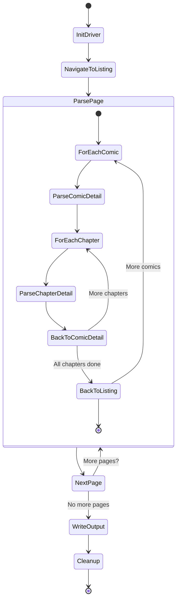

# selenium_webdriver — Architecture Blueprint

> **Generated:** 2026-07-24
> **Project Type:** Node.js Selenium Web Scraper (Comics/Manga)
> **Architecture Pattern:** Script-Driven Browser Automation

---

## Table of Contents

1. [Project Overview](#project-overview)
2. [Architecture Goals](#architecture-goals)
3. [System Context Diagram](#system-context-diagram)
4. [Container Architecture](#container-architecture)
5. [Module Architecture](#module-architecture)
6. [Data Flow](#data-flow)
7. [Error Handling Strategy](#error-handling-strategy)
8. [Scraping Lifecycle](#scraping-lifecycle)
9. [Architecture Decisions](#architecture-decisions)
10. [Extensibility Points](#extensibility-points)

---

## Project Overview

A Node.js browser-automation tool using **Selenium WebDriver 4.x** to scrape JavaScript-rendered comic/manga content from Asura Scans (`asuracomic.net`). The scraper navigates multi-page listings, extracts comic metadata (title, author, artist, rating, genres, description, cover images), drills into individual chapter pages, and persists structured JSON output to disk.

**Target Site:** `https://asuracomic.net/series?page=1`  
**Output:** `comics.json`, `chapters.json`

---

## Architecture Goals

| Goal | Description |
|------|-------------|
| **Reliability** | Robust element interaction via explicit waits and StaleElement retry |
| **Determinism** | No `sleep()` — all waits are condition-based via `WebDriverWait` |
| **Resource Safety** | Guaranteed `driver.quit()` via `try/finally`; temp profile cleanup |
| **Stealth** | Headless execution with automation-detect mitigation flags |
| **Simplicity** | Zero build step, zero deployment, zero external infrastructure |

---

## System Context Diagram

---

## Container Architecture

---

## Module Architecture

---

## Data Flow

---

## Error Handling Strategy

| Error Scenario | Handling |
|----------------|----------|
| `StaleElementReferenceException` | Retry up to 3× with 500ms delay, then throw |
| Element not found / timeout | Catch, log, continue to next element |
| Navigation failure | Catch in outer `try/catch`, log error |
| Driver leak | `driver.quit()` in `finally` block |
| Temp profile leak | `fs.rmSync(userDataDir)` in `finally` block |

---

## Scraping Lifecycle

---

## Architecture Decisions

| Decision | Rationale |
|----------|-----------|
| **Selenium over Scrapy** | Target site is a JS-heavy SPA — needs a real browser to render |
| **Selenium over Playwright** | Existing codebase investment; Playwright noted as potential migration path |
| **ES Modules** | Modern Node.js standard; `"type": "module"` in package.json |
| **No build step** | Direct `node` execution; no transpilation overhead |
| **No deployment** | Local/CI execution only; no server infrastructure needed |
| **Headless=new** | Stealthier headless mode (Chrome 109+) with full rendering |
| **Chrome temp profiles** | Isolated browser state per run; auto-cleaned in finally |
| **XPath selectors** | Target site uses Tailwind CSS with dynamic class ordering — XPath with `contains()` is more robust than CSS selectors |

---

## Extensibility Points

1. **New target sites** — Add new parse functions following the same retry-wrapper pattern
2. **Database persistence** — Replace `writeFileSync` with SQLite or MongoDB writes
3. **Proxy rotation** — Pass `--proxy-server` via Chrome options
4. **User-agent rotation** — Randomize `user-agent` in Chrome options per page
5. **Playwright migration** — Port high-level parse logic, replace Selenium-specific imports
6. **CLI arguments** — Add `commander` or `yargs` for URL/target/page-count parameters
7. **Parallel scraping** — Use `p-limit` to cap concurrent browser sessions
8. **WebDriver BiDi** — Upgrade to BiDi protocol for network interception (block images/CSS)

---

*Generated by architecture-blueprint-generator — comprehensive analysis*
