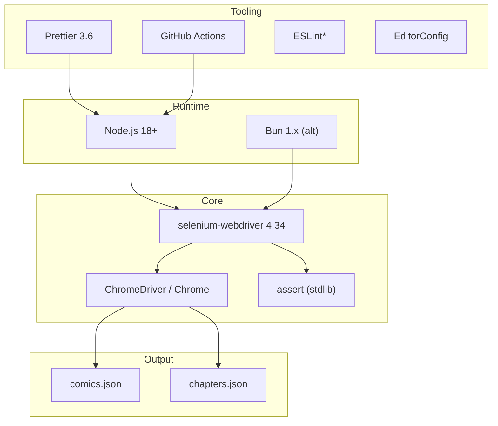
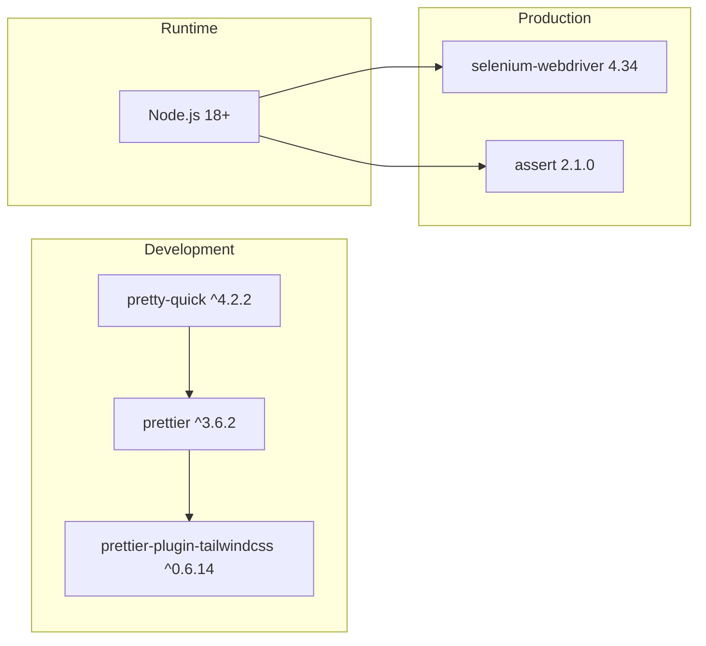

# selenium_webdriver — Technology Stack Blueprint

> **Generated:** 2026-07-24
> **Generator:** technology-stack-blueprint-generator
> **Analysis Depth:** Comprehensive

---

## Table of Contents

1. [Overview](#overview)
2. [Languages & Runtimes](#languages--runtimes)
3. [Dependencies](#dependencies)
4. [Dev Dependencies](#dev-dependencies)
5. [Tooling & Infrastructure](#tooling--infrastructure)
6. [Dependency Graph](#dependency-graph)
7. [Licensing](#licensing)
8. [Scripts Reference](#scripts-reference)
9. [Version Matrix](#version-matrix)
10. [Migration Paths](#migration-paths)
11. [Compatibility Notes](#compatibility-notes)

---

## Overview

A **Node.js 18+** script-based web scraper using **Selenium WebDriver 4.34** to automate Chrome for JavaScript-heavy comic/manga site scraping. No build step, no deployment pipeline — direct execution via `node src/scrape.js`. ES Modules throughout with Prettier formatting.

| Property | Value |
|----------|-------|
| **Stack Type** | Node.js (CLI Scraper) |
| **Language** | JavaScript (ES2022+) |
| **Module System** | ES Modules (`"type": "module"`) |
| **Package Manager** | npm (with bun.lock for Bun compatibility) |
| **Browser Automation** | Selenium WebDriver 4.x + ChromeDriver |

---

## Languages & Runtimes

| Technology | Version | Usage | Scope |
|------------|---------|-------|-------|
| JavaScript (ES2022+) | — | All source files | `src/*.js` |
| Node.js | ^18+ | JavaScript runtime | `package.json` engines |
| npm | — | Package manager | `package-lock.json` |
| Bun | 1.x (compatible) | Alternative runtime/installer | `bun.lock` |

**Minimum Node.js version:** 18+ (required by Selenium WebDriver 4.x ES module support)

---

## Dependencies

| Dependency | Version | Purpose | Bundle Size (approx) |
|------------|---------|---------|----------------------|
| `selenium-webdriver` | `4.34.0` | Core browser automation library — WebDriver API, ChromeDriver management, explicit waits | ~2.5 MB |
| `assert` | `2.1.0` | Node.js assertion module for smoke test validation | stdlib (0 kB) |

### `selenium-webdriver` 4.34.0 Feature Set

| Feature | Used? | Where |
|---------|-------|-------|
| `Builder.forBrowser(chrome)` | ✅ | All scripts |
| `Chrome.Options` | ✅ | `initializeDriver()` |
| `WebDriverWait` / `until` | ✅ | `performGet`, pagination |
| `findElement` / `findElements` | ✅ | All data extraction |
| `StaleElementReferenceError` | ✅ | `utils.js` retry wrappers |
| `getBinaryPaths` (Selenium Manager) | ✅ | `test.js` |
| WebDriver BiDi | ❌ | Not yet adopted |

---

## Dev Dependencies

| Dependency | Version | Purpose |
|------------|---------|---------|
| `prettier` | `^3.6.2` | Code formatting (2-space indent) |
| `prettier-plugin-tailwindcss` | `^0.6.14` | Tailwind CSS class sorting (Prettier plugin) |
| `pretty-quick` | `^4.2.2` | Run Prettier on changed files |

---

## Tooling & Infrastructure



| Category | Tool | Version | Purpose |
|----------|------|---------|---------|
| **Runtime** | Node.js | ^18+ | Script execution environment |
| **Package Manager** | npm | — | Dependency management |
| **Package Manager (alt)** | Bun | 1.x | Faster installs (lockfile present) |
| **Browser Automation** | Selenium WebDriver | 4.34.0 | Programmatic browser control |
| **Browser** | Chrome / ChromeDriver | Latest | Browser engine for rendering |
| **Auto Driver Mgmt** | Selenium Manager | Built-in (4.6+) | Zero-config driver resolution |
| **Formatter** | Prettier | ^3.6.2 | Code formatting |
| **Prettier Plugin** | prettier-plugin-tailwindcss | ^0.6.14 | Tailwind class sorting |
| **Pre-commit Format** | pretty-quick | ^4.2.2 | Format changed files |
| **Editor Config** | EditorConfig | — | Cross-editor consistency |
| **CI/CD** | GitHub Actions | — | CI pipeline (lint + test) |
| **Linting** | ESLint (env only) | — | ESLint configuration present |

> \* ESLint config exists in `.eslintignore` — no `eslint.config.*` file detected. May be unused.

---

## Dependency Graph



---

## Licensing

| Component | License | Notes |
|-----------|---------|-------|
| `selenium_webdriver` (project) | Not specified | Choose MIT / Apache-2.0 / Unlicense |
| `selenium-webdriver` 4.x | Apache-2.0 | |
| `assert` 2.1.0 | MIT | Browserify fork; not needed for Node.js 18+ |
| `prettier` | MIT | |
| ChromeDriver | BSD | Part of Chromium project |

---

## Scripts Reference

| Script | Command | Description |
|--------|---------|-------------|
| `test` | `node src/scrape.js` | Runs the main scraper |
| `format` | `prettier --write './**/**/**/*.{js,mjs,cjs,...}'` | Format all source files |
| `format:check` | `prettier --check './**/**/**/*.{js,mjs,cjs,...}'` | Check formatting without writing |

**Ad-hoc commands:**

```bash
# Run the scraper
node src/scrape.js

# Run alternative scraper
node src/scrape2.js

# Run smoke test
node src/test1.js

# Run alternative test scraper
node src/test.js

# Install dependencies
npm install        # npm
bun install        # Bun (alternative)
```

---

## Version Matrix

| Component | Specified | Installed | Latest Available | Notes |
|-----------|-----------|-----------|------------------|-------|
| `selenium-webdriver` | `4.34.0` | 4.34.0 | ~4.34.x | Pinned exact version |
| `assert` | `2.1.0` | 2.1.0 | 2.1.0 | Browserify polyfill; Node.js 18+ has native assert |
| `prettier` | `^3.6.2` | Latest 3.x | 3.x | Compatible range |
| Node.js | ^18 | — | 22.x | LTS 20+ recommended |

---

## Migration Paths

### Short-term (recommended)

| Change | Reason | Effort |
|--------|--------|--------|
| Remove `assert` dependency | Native `node:assert` in Node.js 18+ | Low |
| Add `eslint` config | Enforce code quality | Low |
| Pin ChromeDriver version | Reproducible builds via Selenium Manager flags | Low |

### Medium-term

| Change | Reason | Effort |
|--------|--------|--------|
| Migrate to WebDriver BiDi | W3C standard, replaces CDP, cross-browser | Medium |
| Add data persistence (SQLite) | Scalable storage over JSON files | Medium |
| Upgrade to Selenium 5.x | Preview features (when stable) | Medium |

### Long-term

| Change | Reason | Effort |
|--------|--------|--------|
| Migrate to Playwright | 2–3× faster, stealthier, modern API | High |
| Containerize scraper | Portable execution via Docker | Medium |

---

## Compatibility Notes

1. **Selenium Manager (4.6+):** Auto-resolves ChromeDriver matching installed Chrome. No manual driver setup needed.
2. **Headless=new:** Chrome 109+ required. The `--headless=new` flag provides full browser capability in headless mode (vs. legacy `--headless` which only renders to DOM snapshot).
3. **ES Modules:** All files use `import`/`export`. No CommonJS (`require`) used anywhere.
4. **`assert` package:** The `assert` npm package is a browserify polyfill. Since Node.js 18+ ships `assert` natively, this dependency is technically redundant.
5. **`await` patterns:** Note that some calls in `scrape.js` use excessive `await` on non-promise values (e.g., `await comicData.length`, `await urlString.split("/")`) — these are no-ops but indicate the codebase was developed iteratively.

---

*Generated by technology-stack-blueprint-generator — comprehensive analysis*
